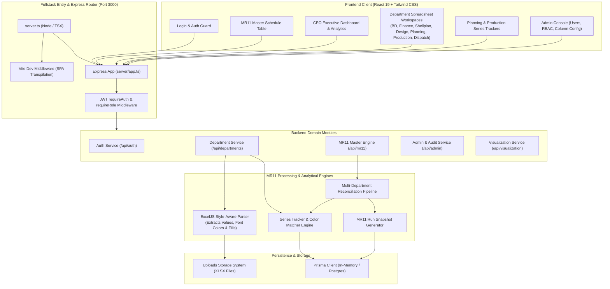
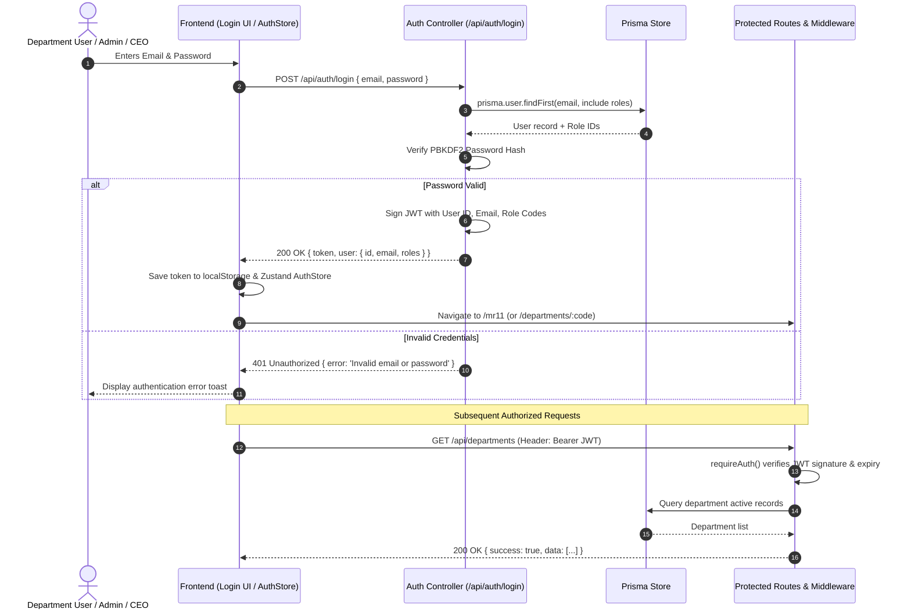
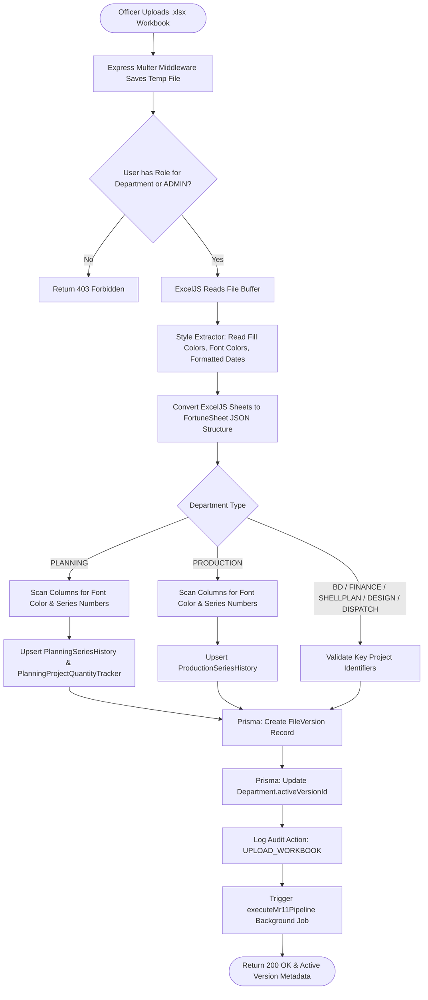
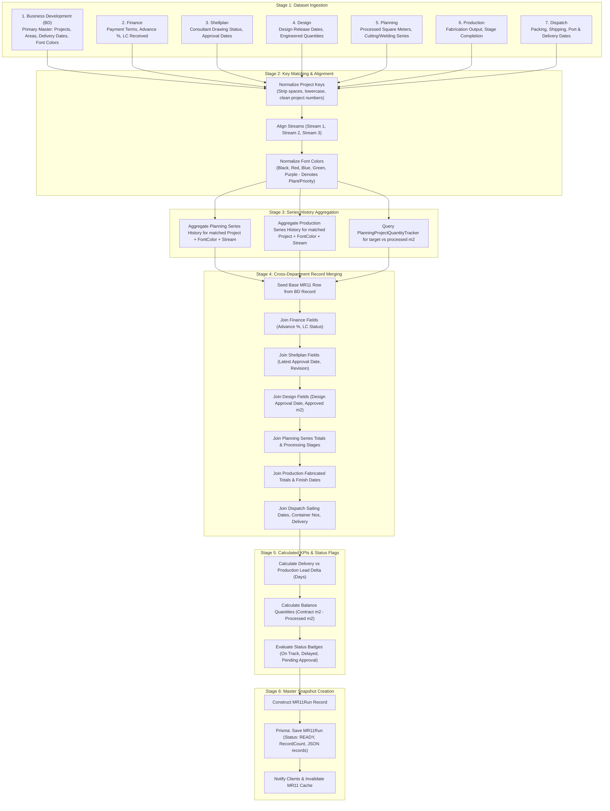
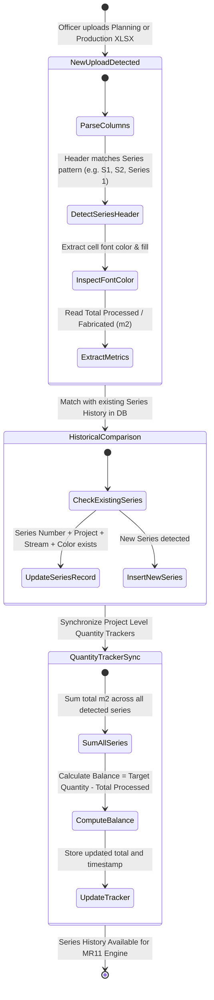
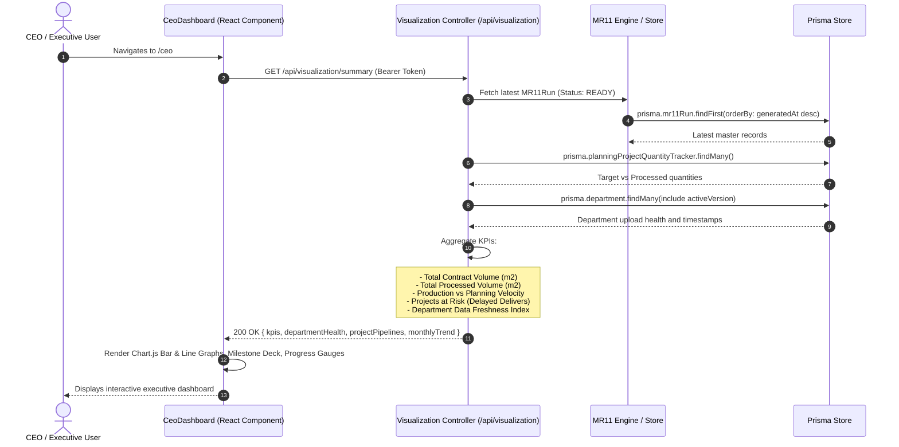

# MFE Formwork MR11 System - System Architecture & Flow Diagrams

This document outlines the end-to-end workflows, system architecture, data reconciliation pipelines, and role-based operational flows for the **MFE Formwork MR11 System**.

---

## 1. High-Level System Architecture

The MFE Formwork MR11 system integrates a high-performance Express backend with a React 19 single-page application (SPA), orchestrating multi-departmental manufacturing schedules, color-coded series tracking, and executive dashboards.

---

## 2. End-to-End User Authentication & RBAC Flow

Access control ensures that users can view and edit data according to their assigned corporate roles.

---

## 3. Department Workbook Upload & Parsing Pipeline

When a department officer uploads their latest spreadsheet, the system parses cell values, formatting, and detects plant/series color codes atomically.

---

## 4. The MR11 Multi-Department Reconciliation Engine

The MR11 Master Consolidation Engine reconciles data from all 7 operational departments into a single coherent master record for every project.

---

## 5. Planning vs. Production Series Tracking State Machine

The system tracks dynamic series additions across multiple file uploads, preserving historical runs even if subsequent uploads only contain new series.

---

## 6. Executive & CEO Dashboard Analytical Data Flow

The CEO Dashboard consumes pre-aggregated metrics and real-time MR11 runs to provide high-level visibility.

---

## 7. Role Permissions Matrix

| Module / Route | ADMIN | CEO | BD | FINANCE | SHELLPLAN | DESIGN | PLANNING | PRODUCTION | DISPATCH |
| :--- | :---: | :---: | :---: | :---: | :---: | :---: | :---: | :---: | :---: |
| **MR11 Master Schedule** (`/mr11`) | Read/Write | Read-Only | Read-Only | Read-Only | Read-Only | Read-Only | Read-Only | Read-Only | Read-Only |
| **CEO Dashboard** (`/ceo`) | Full Access | Full Access | No | No | No | No | No | No | No |
| **BD Department** (`/departments/BD`) | Full Access | Read-Only | Upload/View | No | No | No | No | No | No |
| **Finance Department** (`/departments/FINANCE`) | Full Access | Read-Only | No | Upload/View | No | No | No | No | No |
| **Shellplan Department** (`/departments/SHELLPLAN`) | Full Access | Read-Only | No | No | Upload/View | No | No | No | No |
| **Design Department** (`/departments/DESIGN`) | Full Access | Read-Only | No | No | No | Upload/View | No | No | No |
| **Planning Department** (`/departments/PLANNING`) | Full Access | Read-Only | No | No | No | No | Upload/View | No | No |
| **Production Department** (`/departments/PRODUCTION`)| Full Access | Read-Only | No | No | No | No | No | Upload/View | No |
| **Dispatch Department** (`/departments/DISPATCH`) | Full Access | Read-Only | No | No | No | No | No | No | Upload/View |
| **Admin Console** (`/admin`) | Full Access | No | No | No | No | No | No | No | No |
| **Trigger Master MR11 Run** | Yes | No | Yes (via upload)| Yes (via upload)| Yes (via upload)| Yes (via upload)| Yes (via upload)| Yes (via upload)| Yes (via upload)|
