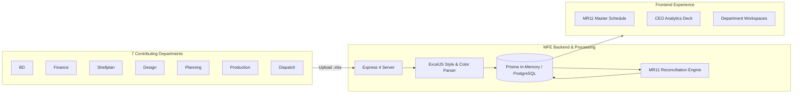

# MFE Formwork MR11 System

An enterprise-grade Micro-Frontend (MFE) and modular operations platform for the **MR11 Master Schedule**, cross-department workbook synchronization, dynamic series tracking, and executive manufacturing analytics.

---

## 📑 Flow Diagrams & Architectural Guides

All workflow diagrams, architecture blueprints, sequence diagrams, and algorithms are documented in comprehensive `.md` files:

1. **[`PROJECT_FLOW.md`](./PROJECT_FLOW.md)**:
   - **System Architecture Diagram**: Fullstack layout connecting React 19, Express, Vite, and Prisma.
   - **Authentication & RBAC Sequence Flow**: Login, JWT verification, role boundaries.
   - **Department Upload & Parsing Pipeline**: Atomic workbook ingestion and style preservation.
   - **MR11 Consolidation Engine**: 6-stage cross-departmental reconciliation pipeline.
   - **Planning vs. Production Series State Machine**: Multi-series tracking and font color mapping.
   - **Executive & CEO Visualization Data Flow**: Pre-aggregated metrics and analytics.
   - **Role Permissions Matrix**: Granular table of permissions per department.

2. **[`docs/DEPARTMENT_WORKFLOWS.md`](./docs/DEPARTMENT_WORKFLOWS.md)**:
   - Information flow across all 7 operational departments (BD, Finance, Shellplan, Design, Planning, Production, Dispatch).
   - Column mapping specifications and font color significance.
   - Sequence diagrams for commercial clearances and dispatch actuals.

3. **[`docs/MR11_ENGINE_DEEP_DIVE.md`](./docs/MR11_ENGINE_DEEP_DIVE.md)**:
   - Pipeline execution flow and state management.
   - Multi-department matching algorithm and weighted scoring matrix.
   - Font color normalization rules and calculated KPI derivations.

---

## ⚡ Quick Architecture Overview



---

## 🚀 Running the Project

### Development Server
```bash
npm run dev
```
Runs `tsx server.ts` on port 3000, mounting the Express API router alongside Vite development middleware.

### Production Build
```bash
npm run build
npm start
```

### Default Credentials
- **Email**: `admin@mfeformwork.com`
- **Password**: `Admin@123456`
